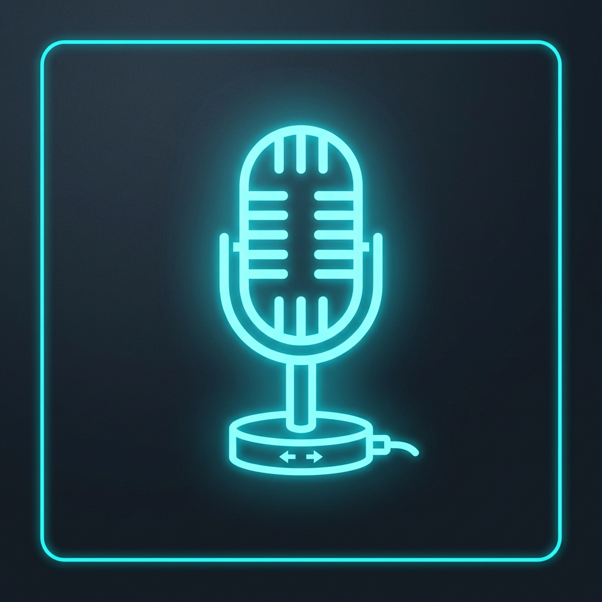

[**🇷🇺 Русский**](README.ru.md) | [**🇺🇸 English**](README.md)

---

<p align="center">
  
</p>

<h1 align="center">MicShift</h1>

<p align="center">
  <strong>Smart real-time microphone management and automatic switching for Windows</strong>
</p>

<p align="center">
  <a href="https://github.com/Fuheshka/MicShift/actions"></a>
  
  
  <a href="LICENSE"></a>
</p>

---

**MicShift** is a modern and lightweight system utility for Windows, developed in C# (.NET 10 & WPF). The program analyzes the audio signal level from your input devices in real-time and automatically switches the active communication microphone (for example, switching from a desktop microphone to a headset when you step away from your desk).

---

## ✨ Key Features

### 1. WASAPI-based Monitoring Architecture
* Instead of the legacy audio stream capture method (NAudio `WaveInEvent`), which led to exclusive access conflicts and device locking by other applications (Discord, OBS, etc.), MicShift uses modern **WASAPI Core Audio** APIs.
* The signal level is read directly via the Windows `AudioMeterInformation.MasterPeakValue` interface. This ensures 100% reliability, prevents crashes, and operates with zero CPU overhead.

### 2. Dynamic Theme Switching (Light / Dark)
* The application supports fully featured dark and light interface themes.
* Color resources are extracted into separate dictionaries: `Themes/DarkTheme.xaml` and `Themes/LightTheme.xaml`.
* Theme switching happens instantly in the settings window without requiring an app restart.

### 3. Interactive Sidebar Interface (WPF)
* The UI is separated into logical tabs:
  * **Dashboard:** The main panel featuring a status indicator, default device selection, animated audio level bars (VU meters), and an auto-switch toggle.
  * **Settings:** Secondary program settings, including a toggle for popup HUD notifications, theme selection, and hotkey hints.
* Volume bars are animated with `QuadraticEase` smoothing to achieve fluid motion.

### 4. Custom OSD Notifications (HUD Overlay)
* Instead of standard, sluggish Windows notifications that linger and distract from work, MicShift features its own overlay window: `NotificationOverlayWindow`.
* Any actions (Mute hotkey trigger, microphone switch, mode change) instantly appear as a neat, semi-transparent banner in the bottom right corner of the screen above the taskbar, which smoothly fades out after 1.2 seconds.

### 5. Background Mode and Global Hotkeys
* Minimizes to the system tray on Close/Minimize with the ability to restore via double-click on the icon.
* Global hotkeys, interceptable from any fullscreen games:
  * `Ctrl + Alt + M` — Quickly mute/unmute the active microphone.
  * `Ctrl + Alt + S` — Cycle through the active microphones.

---

## 📂 Project Structure

Project files are logically organized by directories:
* 📁 `Services/` — Services for auto-switching, global hotkeys, WASAPI monitoring, tray management, and configuration.
* 📁 `Views/` — The main settings window `MainWindow` and the `NotificationOverlayWindow` overlay.
* 📁 `Themes/` — Resource dictionaries for light and dark styling.
* 📄 `LICENSE` — Text of the official MIT license.

---

## ⌨️ Hotkeys

| Key Combination | Action | Visual HUD |
| :--- | :--- | :--- |
| `Ctrl + Alt + M` | Mute/unmute microphone | Yes (mute status) |
| `Ctrl + Alt + S` | Cycle to the next microphone | Yes (new device name) |

---

## 🛠️ Command Line Parameters (CLI)

When launched with arguments, the application runs in console mode, outputs information to PowerShell/CMD, and exits:

```bash
# List all active microphones
MicShift.exe --list

# Show the current default device
MicShift.exe --default

# Switch microphone by name (or part of the name) or GUID
MicShift.exe --switch "PD200X Podcast Microphone"

# Start the application immediately minimized to the tray
MicShift.exe --tray

# Show help
MicShift.exe --help
```

---

## 🚀 Windows Autostart Setup

To make MicShift start automatically with Windows in the system tray:
1. Press `Win + R`, type `shell:startup`, and press Enter.
2. Create a shortcut for the `MicShift.exe` file.
3. In the shortcut properties, add the `--tray` argument at the very end of the **"Target"** field, separated by a space.
   * *Example:* `"C:\Program Files\MicShift\MicShift.exe" --tray`

---

## 📦 Release Build (Single-File)

To create an optimized executable file (Framework-Dependent):

```bash
dotnet publish MicShift.csproj -c Release -r win-x64 -p:PublishSingleFile=true -o ./publish
```

*(Note: The build configuration has been optimized to be Framework-Dependent to significantly reduce file size).*

---

## 📝 License

This project is licensed under the MIT License. For more details, see the [LICENSE](LICENSE) file.
